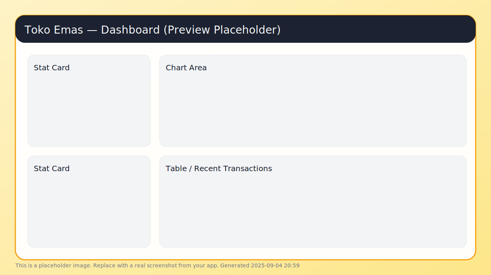

# Toko Emas — Nuxt 3



Aplikasi web toko emas dengan UI modern & profesional berbasis **Nuxt 3 + Tailwind CSS**. Sudah terpasang **Pinia** untuk state, **nuxt-icon** untuk ikon, **Chart.js** untuk grafik, **PapaParse** untuk impor CSV, dan **jsPDF + autotable** untuk ekspor PDF.

> **Node.js 20+ wajib** (lihat `engines` pada `package.json`).

## 🎯 Fitur Utama
- ⚡️ Nuxt 3 + TypeScript (siap SSR/SPA)
- 🎨 Tailwind CSS (utility-first, mudah kustomisasi)
- 🗂️ Pinia (state management sederhana & scalable)
- 🖼️ nuxt-icon (ikon inline yang ringan)
- 📈 Chart.js (dashboard & grafik)
- 📄 jsPDF + autotable (cetak/unduh PDF)
- 📥 PapaParse (impor CSV)
- ☁️ Siap **deploy ke Vercel** (Nitro preset sudah diaktifkan)

## 🛠️ Tech Stack
- **Nuxt**: `latest`
- **@pinia/nuxt**, **@nuxtjs/tailwindcss**, **nuxt-icon**
- **tailwindcss**, **autoprefixer**
- **chart.js**, **papaparse**
- **jspdf**, **jspdf-autotable**
- **TypeScript**

## 📷 Screenshot
File preview tersimpan di: `public/preview/dashboard.svg`  
> Ganti dengan screenshot asli aplikasi kamu supaya README terlihat real. Simpan gambar kamu di jalur yang sama dan commit.

## 🚀 Mulai Cepat
```bash
# 1) clone
git clone https://github.com/<username>/<repo>.git
cd <repo>

# 2) instal dependensi (reproducible)
npm ci

# 3) jalankan mode dev
npm run dev

# 4) build & start (produksi)
npm run build
npm run start
```

> **Port default:** 3000 → http://localhost:3000

## 🗂️ Struktur Direktori (ringkas)
```
.
├─ app.vue                 # shell aplikasi (layout + halaman)
├─ pages/                  # routing berbasis file
├─ components/             # komponen UI
├─ layouts/                # layout global/khusus
├─ assets/css/tailwind.css # entry Tailwind
├─ nuxt.config.ts          # konfigurasi Nuxt (Vercel preset, modul)
├─ tailwind.config.js      # konfigurasi Tailwind
├─ public/preview/         # aset gambar untuk README
└─ package.json
```

## ⚙️ Konfigurasi
File penting:
- **`nuxt.config.ts`**
  - Modules: `@pinia/nuxt`, `@nuxtjs/tailwindcss`, `nuxt-icon`
  - Nitro preset: `vercel` (siap deploy)
  - `app.head.title`: “Toko Emas — Prototype v4.1”
- **`tailwind.config.js`**
  - `content` sudah menunjuk ke `components/`, `layouts/`, `pages/`, dan `app.vue`

### (Opsional) Variabel Lingkungan
Buat `.env` bila diperlukan konfigurasi publik:
```env
# contoh opsional
NUXT_PUBLIC_APP_NAME="Toko Emas"
NUXT_PUBLIC_CURRENCY="IDR"
NUXT_PUBLIC_DATE_LOCALE="id-ID"
```

## 📊 Impor CSV & Ekspor PDF
- **CSV**: gunakan **PapaParse** untuk membaca file `.csv` lalu normalisasi data sebelum disimpan ke state/DB.
- **PDF**: gunakan **jsPDF** + **autotable** untuk membuat invoice/nota/laporan tabel.

## ☁️ Deploy
- **Vercel**: sudah disetel `nitro: { preset: 'vercel' }`
  1. Push ke GitHub
  2. Import repo ke Vercel → Framework **Nuxt.js**
  3. Node 20 otomatis (atau set `NODE_VERSION=20`)
- **Server Node**:
  ```bash
  npm run build
  npm run start
  ```

## 🧩 Skrip NPM
```json
{
  "dev":   "nuxt dev",
  "build": "nuxt build",
  "start": "nuxt start"
}
```

## 🧹 .gitignore (disarankan)
Pastikan file sementara tidak ikut ke repo:
```
node_modules
.nuxt
.output
dist
.cache
.env
.env.*
*.local
npm-debug.log*
yarn-*.log*
.pnpm-debug.log*
.DS_Store
.vercel
.netlify
```

## ❓ Troubleshooting
- **Node version error** → gunakan Node **20+** (nvm / nvm-windows).
- **Port bentrok** → set `PORT=4000 npm run dev`.
- **Icon tidak tampil** → pastikan `nuxt-icon` aktif di `nuxt.config.ts`.

## 📄 Lisensi
Hak cipta © Bernadus Boli. Semua hak dilindungi.
